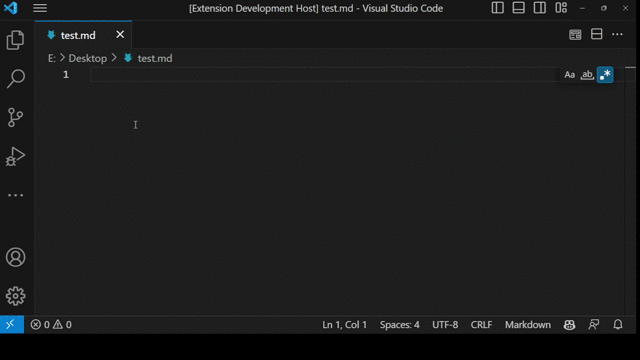

# insert-quran-verse README

Insert Quran Verse allows you to easily use partial search to find the verse(s) you are looking for and allows you to insert them into your document. It is based on the InDesign [quran-plugin](https://www.sadeea.de/quran-plugin) by Mohammad Sadee.

## Usage

1. To insert a verse, open the Command Pallete and search for "Insert Quran verse" and press enter.
2. Then write the word or portion of a verse to be searched and press enter.
3. Select the verse you want to insert and press enter again to insert.

## Extension Settings

This extension contributes the following settings:

* `insert-quran-verse.prefix`: Add a prefix to inserted verses.
* `insert-quran-verse.suffix`: Add a suffix to inserted verses.

## Known Issues

The extension might fail to look up a verse due to how diacritics work in
Arabic language. It is recommended to search with a short word or a portion of
a verse.

## Release Notes

Users appreciate release notes as you update your extension.

### 0.0.1

Initial release of Insert Quran Verse.